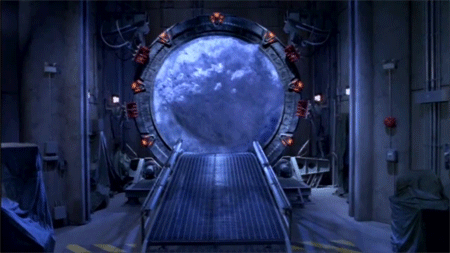

# A JavaScript visual FX library.

Think stargate wormhole sequence but a hundred times less the budget.

## features

* append a canvas visual effect to any box(div or document) in the DOM,
and activate it when you choose.

## Usage

## chain methods for multiple effects.
